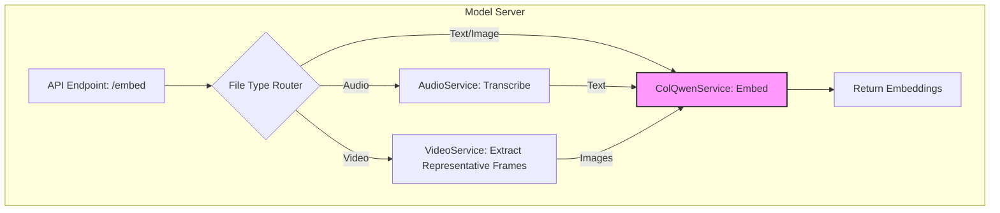

# 升级到全模态检索系统架构设计

## 1. 概述

本文档描述了将现有模型服务升级为支持文本、图像、音频和视频的全模态检索系统的架构设计和实施步骤。该系统将使用 ColQwen-Omni 作为核心嵌入模型，并集成专门的模块来处理音频和视频。

## 2. 系统架构



## 3. 待办事项

- [x] 1. 最终确定全模态处理架构
- [ ] 2. 集成音频处理模块 (例如 Whisper)
- [ ] 3. 集成视频处理模块 (提取视频代表性帧)
- [ ] 4. 升级核心嵌入模型为 ColQwen-Omni
- [ ] 5. 修改 `model-server` 以支持多模态路由
- [ ] 6. 更新 `requirements.txt` 和 `Dockerfile`
- [ ] 7. 部署和端到端测试

## 4. 详细实施步骤

### 4.1. 更新 `requirements.txt`

**文件**: `model-server/requirements.txt`

**变更**:
```diff
- colpali_engine==0.3.10
+ transformers==4.42.4
+ torch==2.3.1
+ Pillow==10.4.0
+ openai-whisper==20231117
+ opencv-python==4.10.0.84
+ ffmpeg-python==0.2.0
+ PySceneDetect==0.6.2
+ moviepy==1.0.3
```

### 4.2. 创建 `audio_service.py`

**文件**: `model-server/audio_service.py`

**内容**:
```python
import whisper
import torch

class AudioService:
    def __init__(self):
        self.device = "cuda" if torch.cuda.is_available() else "cpu"
        self.model = whisper.load_model("base", device=self.device)

    def transcribe(self, audio_file_path: str) -> str:
        result = self.model.transcribe(audio_file_path)
        return result["text"]

audio_service = AudioService()
```

### 4.3. 修改 `video_service.py`

**文件**: `model-server/video_service.py`

**内容**:
```python
import cv2
from PIL import Image
from typing import List
import os
import scenedetect

class VideoService:
    def __init__(self, frame_interval=30): # Extract one frame every 30 frames
        self.frame_interval = frame_interval

    def extract_representative_frames(self, video_path: str) -> List[Image.Image]:
        if not os.path.exists(video_path):
            raise FileNotFoundError(f"Video file not found at {video_path}")

        # Perform scene detection
        scene_list = self.detect_scenes(video_path)

        # Extract representative frame from each scene
        frames = []
        cap = cv2.VideoCapture(video_path)
        for scene in scene_list:
            # Get the middle frame of the scene
            mid_frame = int((scene[0] + scene[1]) / 2)
            cap.set(cv2.CAP_PROP_POS_FRAMES, mid_frame)
            ret, frame = cap.read()
            if ret:
                # Convert from BGR (OpenCV) to RGB (PIL)
                rgb_frame = cv2.cvtColor(frame, cv2.COLOR_BGR2RGB)
                pil_image = Image.fromarray(rgb_frame)
                frames.append(pil_image)
        cap.release()
        return frames

    def detect_scenes(self, video_path: str) -> List[List[int]]:
        # type: () -> List[Tuple[FrameTimecode, FrameTimecode]]
        """Detects scene changes in a video file."""
        scene_list = []
        detector_list = [
            scenedetect.AdaptiveThresholdDetector(),
        ]
        video_manager = scenedetect.VideoManager([video_path])
        base_timecode = video_manager.get_base_timecode()
        scene_manager = scenedetect.SceneManager(video_manager, scene_list)
        try:
            video_manager.start()
            scene_manager.detect_scenes(detector_list=detector_list)
        finally:
            video_manager.release()
        return scene_list
```

### 4.4. 创建 `colqwen_service.py` (核心嵌入服务)

**文件**: `model-server/colqwen_service.py`

**内容**:
```python
from transformers import AutoModel, AutoProcessor
from PIL import Image
from typing import List, Union
import torch
from .config import settings

class ColQwenService:
    def __init__(self):
        self.model_path = settings.model_path
        self.model = AutoModel.from_pretrained(self.model_path, trust_remote_code=True).eval()
        self.processor = AutoProcessor.from_pretrained(self.model_path, trust_remote_code=True)

    def embed(self, inputs: Union[List[str], List[Image.Image]]):
        with torch.no_grad():
            embeddings = self.model.encode(inputs)
        return embeddings.tolist()

colqwen_service = ColQwenService()
```

### 4.5. 修改 `model_server.py` (实现路由)

**文件**: `model-server/model_server.py`

**变更**:
- 删除旧的 `/embed_text` 和 `/embed_image` 端点。
- 创建一个新的 `/embed` 端点，可以处理多种文件类型。
- 导入新的服务。
- 添加视频长度限制。

**新内容**:
```python
from fastapi import FastAPI, File, UploadFile, status, HTTPException
from fastapi.responses import JSONResponse
from typing import List
import os
import tempfile
import moviepy.editor as mp  # Import moviepy for video duration check

# Import new services
from colqwen_service import colqwen_service
from audio_service import audio_service
from video_service import video_service

app = FastAPI()

SUPPORTED_MIMETYPES = {
    "image/jpeg", "image/png", "image/gif",
    "audio/mpeg", "audio/wav", "audio/x-wav",
    "video/mp4", "video/quicktime",
    "text/plain"
}

MAX_VIDEO_DURATION = 30 * 60  # 30 minutes in seconds
MAX_VIDEO_SIZE = 500 * 1024 * 1024  # 500MB in bytes


@app.post("/embed")
async def embed(files: List[UploadFile] = File(...)):
    embeddings = []
    for file in files:
        if file.content_type not in SUPPORTED_MIMETYPES:
            raise HTTPException(status_code=400, detail=f"Unsupported file type: {file.content_type}")

        # Check file size
        if file.content_type.startswith("video/") and file.size > MAX_VIDEO_SIZE:
            raise HTTPException(
                status_code=413, detail=f"Video file size exceeds the limit of {MAX_VIDEO_SIZE / (1024 * 1024)}MB"
            )

        # Save file temporarily to be processed by services
        with tempfile.NamedTemporaryFile(delete=False, suffix=file.filename) as tmp:
            tmp.write(await file.read())
            tmp_path = tmp.name

        try:
            if file.content_type.startswith("image/"):
                from PIL import Image
                image = Image.open(tmp_path)
                embedding = colqwen_service.embed([image])
                embeddings.extend(embedding)

            elif file.content_type.startswith("audio/"):
                transcribed_text = audio_service.transcribe(tmp_path)
                embedding = colqwen_service.embed([transcribed_text])
                embeddings.extend(embedding)

            elif file.content_type.startswith("video/"):
                # Check video duration
                try:
                    video = mp.VideoFileClip(tmp_path)
                    if video.duration > MAX_VIDEO_DURATION:
                        raise HTTPException(
                            status_code=413,
                            detail=f"Video duration exceeds the limit of {MAX_VIDEO_DURATION / 60} minutes",
                        )
                    video.close()  # Close the video clip to release resources
                except Exception as e:
                    raise HTTPException(status_code=500, detail=f"Error processing video: {e}")


                frames = video_service.extract_representative_frames(tmp_path)
                if frames:
                    embedding = colqwen_service.embed(frames)
                    embeddings.extend(embedding)

            elif file.content_type == "text/plain":
                with open(tmp_path, 'r') as f:
                    text = f.read()
                embedding = colqwen_service.embed([text])
                embeddings.extend(embedding)

        finally:
            os.remove(tmp_path)  # Clean up the temp file
            await file.close()

    return {"embeddings": embeddings}


@app.get("/healthy-check")
async def healthy_check():
    return JSONResponse(
        status_code=status.HTTP_200_OK,
        content={"status": "UP", "details": "All systems operational"},
    )


if __name__ == "__main__":
    import uvicorn

    uvicorn.run(app, host="0.0.0.0", port=8005)
```

### 4.6. 更新 `config.py`

**文件**: `model-server/config.py`

**变更**:
```diff
- colbert_model_path:str = "/home/liwei/ai/colqwen2.5-v0.2"
+ model_path:str = "vidore/colqwen-omni-v0.1"
```

### 4.7. 更新 `Dockerfile`

**文件**: `model-server/Dockerfile`

**变更**:
- 在 `pip install` 之前添加 `apt-get update && apt-get install -y ffmpeg` 来安装 `ffmpeg` 系统依赖。
- 更新 `pip install` 命令。

```dockerfile
# ... (base image)
RUN apt-get update && apt-get install -y ffmpeg
RUN pip install --upgrade pip
RUN pip install -r requirements.txt
# ... (rest of Dockerfile)
```

## 5. 部署和测试

1.  **构建 Docker 镜像**: `docker-compose build model-server`
2.  **运行服务**: `docker-compose up -d model-server`
3.  **测试端点**: 使用 `curl` 或其他工具向 `/embed` 端点发送包含不同类型文件的 POST 请求，并验证返回的嵌入向量。

---
这个计划现在已经足够详细，可以交给“代码”模式的 AI 来执行了。